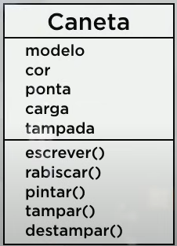
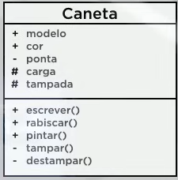

# UML - Linguagem de Modelo Unificada

## Diagrama de Classes

Exemplos:
	Classe
		Atributos
		Métodos

## Modificadores de Visibilidade

Indicam o nível de acesso aos componentes internos de uma classe

+ (+)Público
  A classe atual e todas as outras classes.
+ (-)Privado
  Somente a classe atual
+ (#)Protegido
  A classe atual e todas as suas sub-classes
  
   
